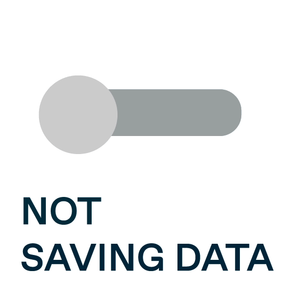

# Bem-vindos ao meu perfil!
⠀⠀⠀⠀⠀⠀⠀⠀⠀⠀⠀⠀⠀⠀⠀⠀⠀⠀⠀⠀⠀⠀⠀⠀⠀⠀⠀⠀⠀⠀⠀⠀⠀⠀⠀

 

### Sobre mim 👩
Engenheira apaixonada por números e tecnologia, busco oportunidades de atuar na área de análise de dados, na qual venho estudando e aperfeiçoando técnicas e habilidades que focam nos resultados, metodologias ágeis e resolução de problemas.
 
 
 📍"Acredito em Deus, todos os outros devem apresentar dados 📈 ." - William Edwards Deming.
  
  
⠀⠀⠀⠀⠀⠀⠀⠀⠀⠀⠀⠀⠀⠀⠀⠀⠀⠀⠀⠀⠀⠀⠀⠀⠀⠀⠀⠀⠀⠀⠀⠀⠀⠀⠀⠀Visualize meu perfil no Linkedin:⠀ 
